# Sistema de facturación y manejo de inventario Common

Este programa y sistema cuenta con diversas capacidades para el manejo de inventarios y de la facturación y ventas de varios tipos de negocios. Está diseñado de forma específica para panaderías, pero este taambién resulta muy útil y eficiente para el trabajo en supermercados, restaurantes y más.

## Instalación
Se puede obtener los archivos de instalación desde la siguiente dirección:
https://github.com/MinorPorras/SistemaFacturacionCommon/releases/latest

## Requisitos del sistema
- Windows 10 o superior
- .NET Framework 4.7.2
- Impresora térmica compatible (opcional, para facturas/habladores)
- Conexión a internet únicamente necesaria para actualizaciones (las actualizaciones también se pueden descargar manualmente desde la página de lanzamientos, sin necesidad de conexión a internet.)

## ¿Quieres contribuir?
¡Las contribuciones son bienvenidas! Por favor abre un *issue* antes de enviar un *pull request*.

## Funcionalidades
El programa como tal está divido en 4 módulo principales los cuales permiten manejar gran parte de todo el proceso de trabajo en lo que respecta al manejo de inventarios y de ventas. Estos 3 módulos son los siguientes
- Mantenimiento y manejo de inventario
- Facturación y ventas
- Reportes
- Configuraciones

### 1. Mantenimiento e inventario
Por medio de este módulo se maneja todo lo relacionado con elementos que se utilizan alrededor de toda la aplicación. Dentro de este menú de mantenimiento, se puede gestionar lo siguiente:
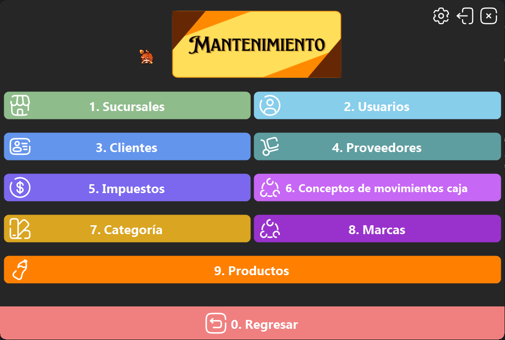
- **Sucursal**: Se puede modificar la información de la sucursal o tienda en la que se esté trabajando el sistema, esta información se verá reflejada alrededor de la aplicación y se puede agregar el logo, nombre, dirección, telefono, correo y más información, la cual será la información reflejada dentro de las facturas generadas por el sistema.
- **Usuarios**: Estas son las cuentas de las personas que utilizarán la aplicación. A estas se les puede asignar colores específicos para que sean reconocible más sencillamente, se tiene un sistema de inicio de sesión sencillo y además los usuarios pueden tener 2 roles específicos, el primero es el rol de "Adminsitrador" con acceso a toda la aplicación y el segundo es el rol de "Cajero", el cual solo tiene acceso al sistema ded caja de la aplicación y no puede ingresar a ningún lugar que no esté relacionado con este. (El sistema incluye una cuenta de administrador predeterminada (usuario: Admin contraseña: 2004030) con una contraseña temporal. Se recomienda encarecidamente cambiar esta contraseña inmediatamente tras la primera instalación.)
- **Clientes**: Aquí se puede agregar la información de los clientes a los que frecuentemente se le vente productos o necesitan estar identificados (El sistema viene con un cliente por defecto 'Generico', agregar más cuando sea necesario)
- **Proveedores**: Aquí se puede agregar la información correspondiente a los proveedores, como nombre, correo, telefono y más importante se puede agregar la información relacionda con los pedidos realizados a estos, indicando el día de entrega y el día de recibimiento de estos durante la semana, esta información se verá reflejada en el menú principal de la aplicación en un calendario semanal de pedidos
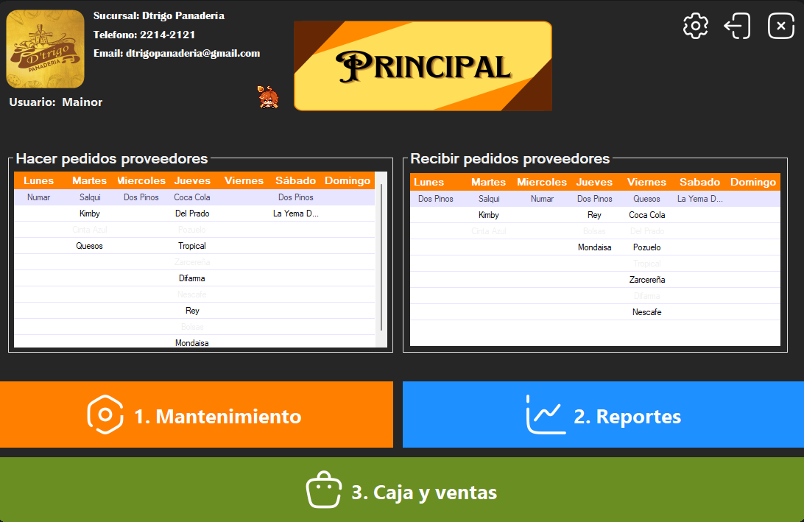
- **Conceptos de movimientos de caja**: Se puede agregar, modificar, eliminar y filtrar en el sistema distintos tipos de razones por las que sale o entra dinero en efectivo de la caja registradora. En este caso se pueden definir razones totalmente personalizadas de forma individual para las entradas y las salidas de efectivo para los procesos de arqueo de caja
- **Categorías**: Se puede agregar, modificar, eliminar y filtrar las distintas categorías en las que dividir los productos, estas funcionan principamente para poder agrupar de mejor forma los productos y su filtrado
- **Marcas**: Se puede agregar, modificar, eliminar y filtrar los datos de marcas específicas en las que se pueden dividir los productos para poder agruparlos mejor y filtrarlos

#### Mantenimiento de productos
La parte principal del módulo de mantenimiento en este se puede buscar, modificar, eliminar y agregar los productos utilizados en el sistema y es desde aquí donde se maneja todo lo relacionado con los productos de la tienda. 
- Los productos pueden ser filtrados, por nombre, por código, y se puede habilitar su busqueda por marca, categoría y proveedor
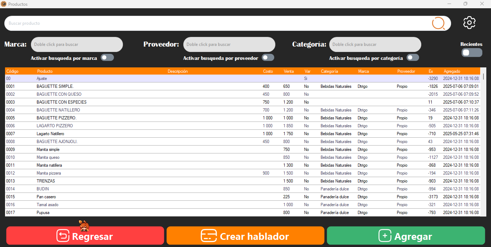
- Los productos pueden ser filtrado de forma que se muestren los próductos más recientes agregados en el sistema para llevar un control de lo que se va agregarndo y las fechas en las que se realizaron
- Se puede agregar un producto nuevo o modificar los valores de un producto ya creado, pudiendo indicarle una gran cantidad de información importante y descriptiva como el código, nombre, descripción, Marca, Proveedor, categoría, existencias, precio base, impuesto, ganancia, precio de venta
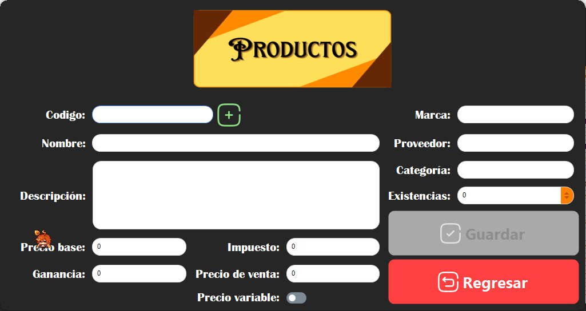
- Para productos estándar, el sistema calcula automáticamente el precio de venta a partir del precio base, el impuesto y el margen de ganancia. En cambio, los productos con precio variable (útiles para ventas por peso o unidad variable) no usan estos cálculos: el cajero define el precio final al momento de la venta.
- Se puede eliminar los productos del sistema por medio de un botón en un menú contextual en la tabla
- Se tiene un sistema de impresión de habladores, estos usan la impresora de la impresión de la factura para generar pequeños papeles con e nombre del producto, código y el precio de este últi para colocar los precio exactos del sistema en los productos en la tienda, pudiendo desde la misma interfaz escoger varios productos y copias de cada uno de ellos para imprimirlos
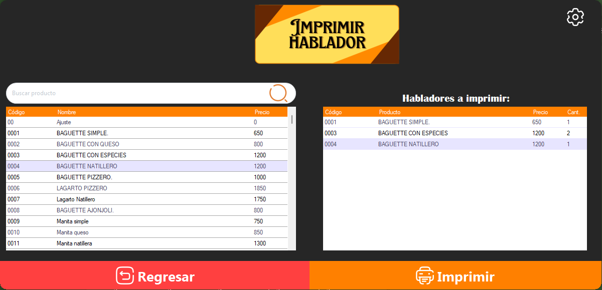

### 2. Facturación y ventas
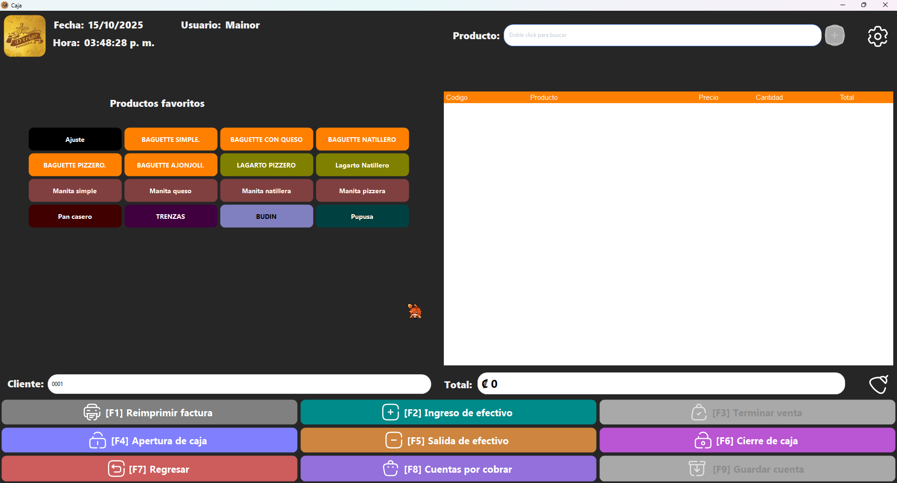
Este se trata de un completo sistema de ventas y caja customizable este cuentas con una gran cantidad de funcionalidades que facilitan y agilizan de gran forma el trabajo de los cajeros. Entre las funciones con las que cuenta este tenemos:
- Interfaz adaptable a distintos tamaños de pantallas
- Compatibilidad completa con escaneres y lectores de códigos de barras
- Busqueda específica de productos directamente desde la caja
- Seguimiento de los productos de la venta en una tabla en la que se puede modificar la cantidad de cada uno de forma manual o eliminarlo de la venta de forma sencilla
- Manejo de productos con precios variables por medio de un dialogo en el que se indica el valor específico de este
- Finalización de ventas con soporte para distintos tipos de ventas como Efectivo, tarjeta, Sinpe movil, Depósitos bancarios y pagos Mixtos en efectivo y en tarjeta, además del cálculo automático del vuelto y utilidades para el calculo de totales y montos restantes para ventas mixtas
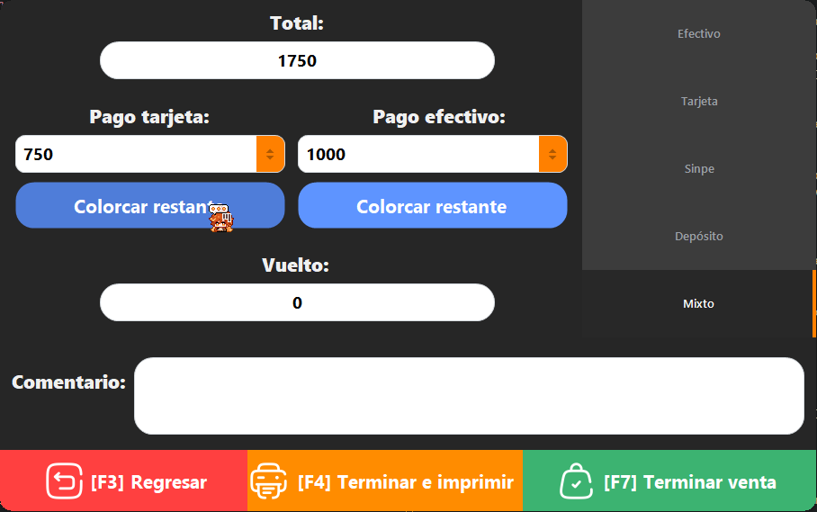
- Permite la generación de las facturas instantaneamente al momento de finalizar la venta o su reimpresión por medio de la sección de "reimpresión de facturas" en donde además de esto se pueden ver los detalles de las facturas realizadas
- Personalización específica de la tienda en la que se utiliza mostrando en la interfaz el logo de esta y además a la hora de imprimir las facturas mostrando la información específica de la sucursal
- Personalización de la sección de productos favoritos en la cual se pueden agregar de forma ilimitada los productos más vendidos usalmente para que sean de un acceso más sencillo. Se puede personalizar su orden en la lista y el color individual de cada botón

#### Cuentas por cobrar
Uno de los módulos principales de este sistema es el de cuentas por cobrar. En este desde la caja se pueden generar las cuentas por cobrra agregando los productos y el cliente que tendrá asignada la cuenta por cobrar.
- Permite el guardado de las cuentas por cobrar agregandole un comentario y cliente que lo identifique de mejor forma
- Permite la vista y filtrado de las cuentas por cobrar dependiendo de su estado de cobro (Estos pueden ser: Activo, Inactivo o Cobrada, cada uno identificada por un color diferente)
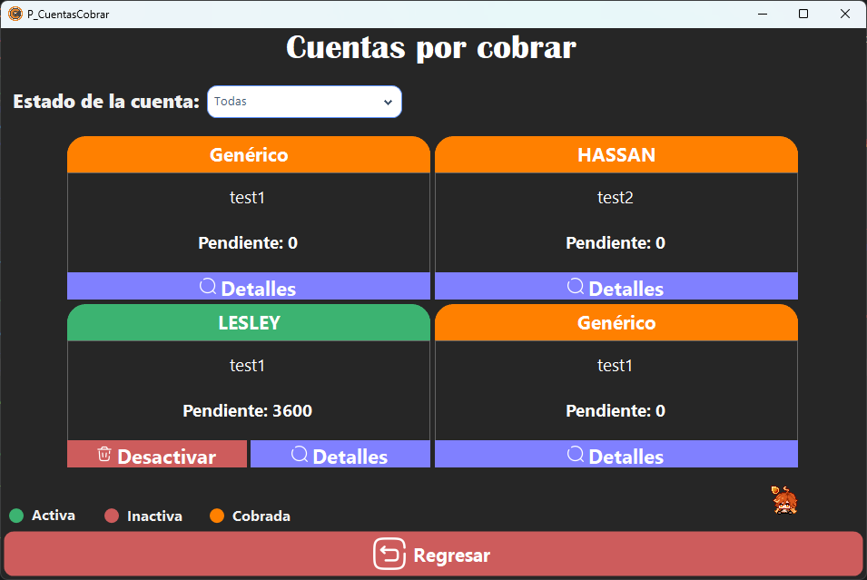
- Permite la vista de los detalles de las cuentas por cobrar, su información general y los pagos abonados a esta
- Permite la activación y desactivación de las cuentas por cobrar
- Permite la modificación de las cuentas por cobrar por medio de su propio sistema de caja exclusivo, en el que se puede actualizar su información como los productos, cantidades, comentario y cliente
- Permite el pago de las cuentas por cobrar por mediode tractos o abonos así como la impresión de facturas de abonos específicas que muestran el dinero restante para la venta y al terminar de pagar completamente la cuenta esta pasa a estar con el estado de cobrada y se puede imprimir la factura completamente
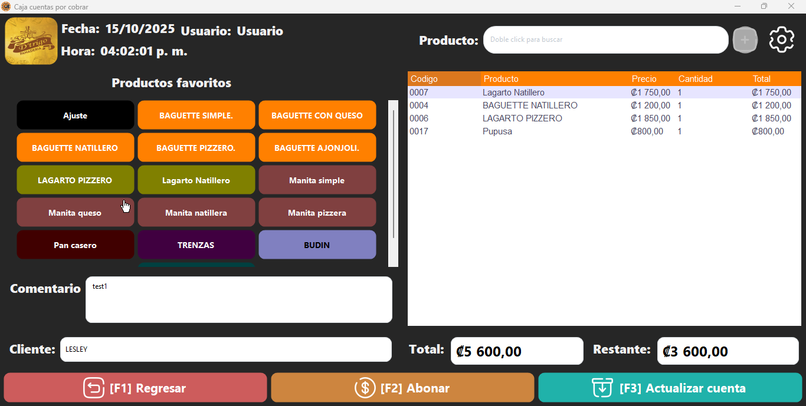

#### Arqueos de caja
Otro de los sistemas más esenciales del sistema de caja es el de los arqueos de caja por medio de este se puede realizar la asignación de responsabilidades del dinero de la caja a los cajeros específicos durante su turno de trabajo. El flujo de este proceso sería el siguiente
1. El cajero inicia sesión en su cuenta y en la caja presiona el botón de Apertura de caja o el atajo f4
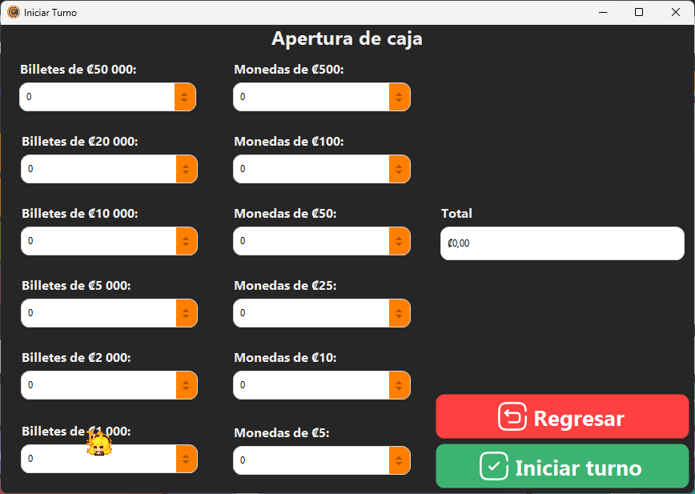
2. En este hace el conteo de efectivo que hay en caja al momento de inciar su turno y presiona el botón de iniciar turno
3. Durante el turno si el cajero debe de sacar o ingresar dinero debe de registrar esta entrada o salida por medio de los botones de "Ingreso de efectivo" o "Retiro de efectivo" (o sus atajos f2 o f5 según el caso), en este deben de indicar, el concepto de entre los ingresados en el módulo de mantenimiento y un comentario o número de factura que ayude a indentificar la razón de este movimiento (Las ventas normales no cuentan para estas salidas o entradas ya que se gestionan de forma automática)
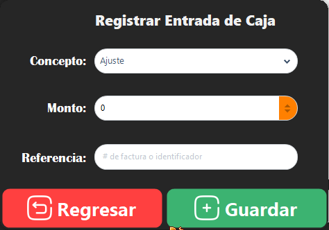
4. Al momento en el que el usuario termina su turno presiona el botón de cierre de caja o f6, en este prefereiblemente bajo la supervisión de algun superior se hace el conteo final del efectivo en la caja en comparación del efectivo que debería de haber. (En este proceso solo se debe de hacer el conteo del dinero y el sistema calcula automáticamente la diferencia absoluta (monto en colones) y la diferencia porcentual entre el efectivo esperado y el efectivo real.)
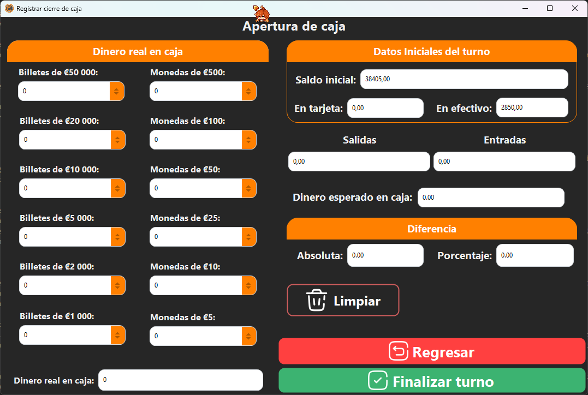
5. Al presionar el botón de "Finalizar turno", se muestra de nueo la pantalla de apertura de caja para que inicie el siguiente turno de trabajo, cargandose este directamente con el dinero con el que cerró el último cajero para que este lo vuelva a contar y coloque el dinero con el que se va a quedar la caja al momento en el que inicia su turno

### 3. Reportes
Dentro de este módulo los administradores del sistema serán capaces de ver el rendimiento de las ventas de la tienda de forma mucho más específica pudiendo generar los reportes y visualizarlos dentro de la aplicación o la generación de documentos PDFs para su descarga y posterior uso.
#### Reportes de ventas generales
Aquí podemos generar reportes específicos de las ventas obtenidas en el rango de tiempo específicado. Este reporte nos permite ver la siguiente información
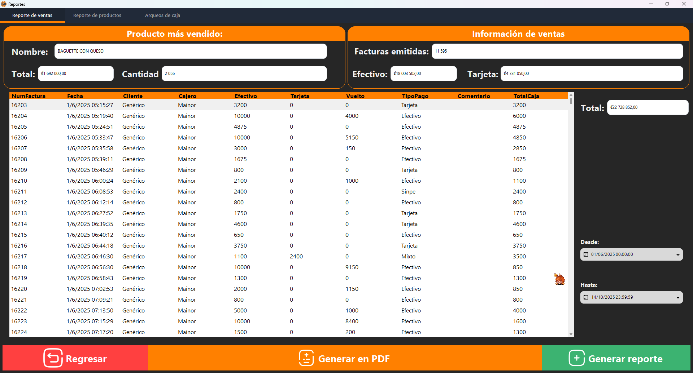
- Nombre, total y cantidad vendida del producto con mejor desempeño de ventas en terminos de volumen de ventas en ese rango de tiempo
- Cantidad de facturas emitidas
- Total de ventas en efectivo y en tarjeta (Este utlimo abarca ventas en tarjeta, sinpe, depósitos)
- Total de ventas en ese tiempo

#### Reportes de ventas de productos
Por medio de este tipo de reportes los administradores pueden tener una vista más clara de los distintos volumenes de ventas de los productos de la tienda en un rango en específico de tiempo. En este se puede crear una lista de productos acomodados ya sea por total vendido o por cantidad vendida al general el reporte este muestra ordenados los productos segun los filtros y la cantidad de productos a mostrar. Este muestra:
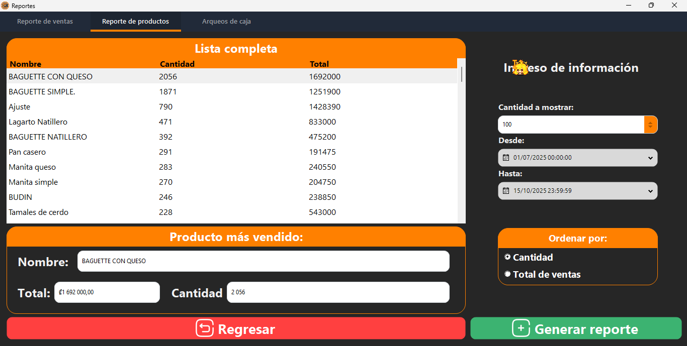
- Lista completa de productos más vendidos con el tamaño a mostrar especificado por el usuario
- Nombre, total y cantidad vendida del producto con mejor volumen de ventas teniendo en cuenta los filtros indicados

#### Reportes de arqueos de caja
En este se puede filtrar por cajero y fecha los distintos arqueos de caja realizados en el sistema.
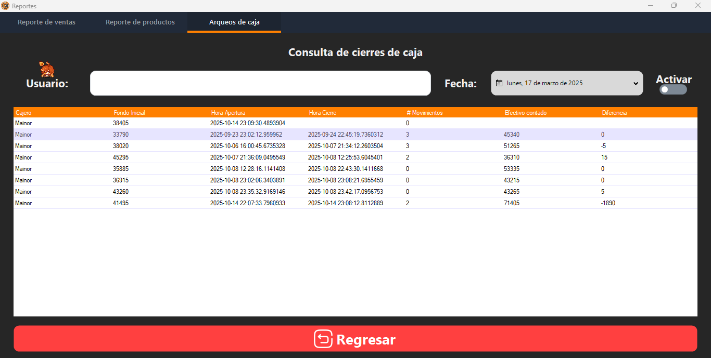
Además se puede ver la información específica de cada arqueo de caja para comprender los valores que tienen estos y analizarlos de mejor forma
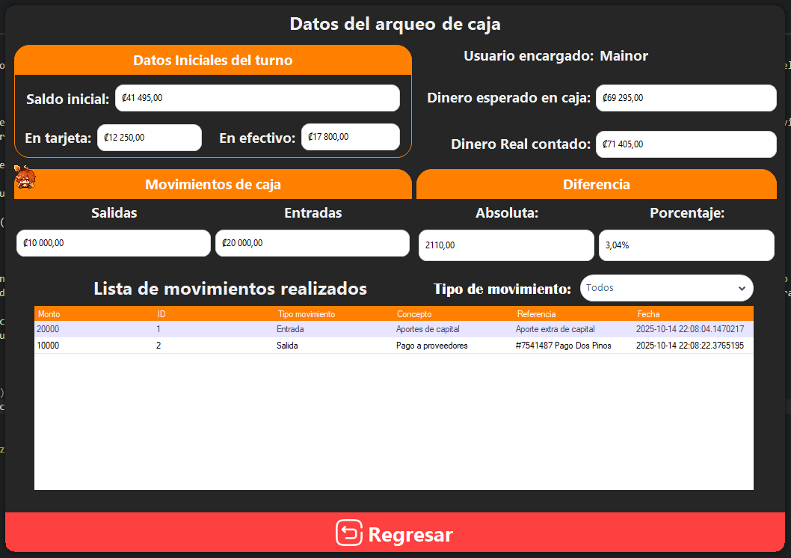

### 4. Configuraciones
La aplicación cuenta con un sencillo sistema de configuraciones el cual permite personalizar varios procesos esenciales del sistema. No hay una pestaña en la que se abra siempre sino que dependiendo del módulo en el que se esté esta se abrira en la más relevante para este, por ejemplo en el módulo de  mantenimiento ingresará a la configuración de código automaticos, en el de ventas en el de productos favoritos y en el de reportes a la configuración de la base de datos y directorios de descarga. Entre estos procesos se encuentran:
#### Información de la aplicación y actualizaciones automáticas
Pestaña principal que muestra la información de la aplicación y permite la visualización del código fuente, la lista de cambios del proyecto y principalmente permite la busqueda de nuevas versiones de la aplicación y la configuración de la busqueda automática de las ctualizaciones cada vez que se inicia la aplicación
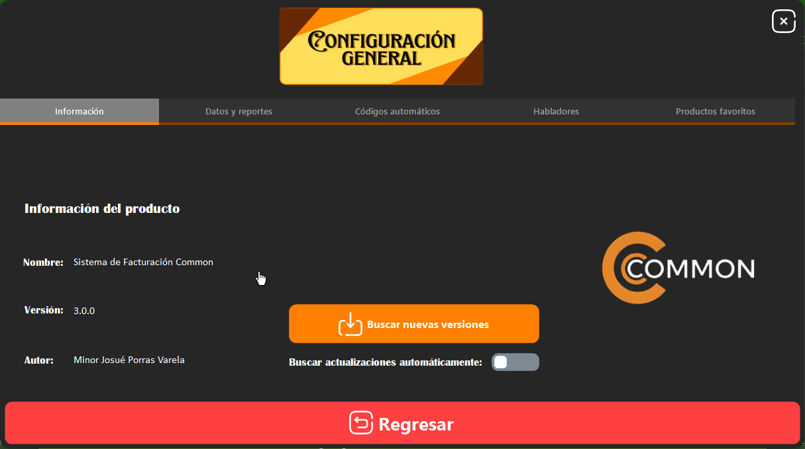

#### Gestión de base de datos y reportes
Uno de las secciones más importantes de las configuraciones. Dentro de esta los administradores pueden gestionar de diversas formas la base de datos de la aplicación y los reportes. Del lado de las base de datos estas permiten:
- El respaldo de la base de datos creando copias de la base de datos que pueden ser almacenadas o distribuidas como se necesiten
- La importación de bases de datos respaldas para casos extremos en los que se necesita volver a obtener información de la base de datos debido a la perdida de información o explotaciones de vunerabilidades
- Modificación de la carpeta donde se guardan los respaldos de la base de datos
Mientras que del lado de los reportes simplemente se puede modificar la dirección del directorio de descarga en el que estarán los reportes en pdf que se descarguen del sistema
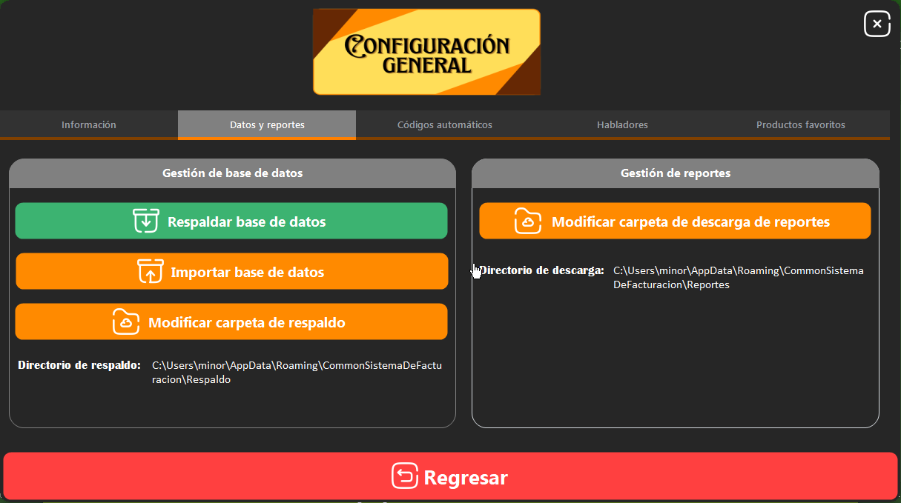

#### Generación de códigos automáticos
Un forma muy importante en la que se busca agilizar el proceso de mantenimiento es por medio de un sistema de generación de códigos de forma automática. En este por cada uno de los elementos personalizables en el módulo de mantenimiento se puede indicar al programa que al presionar el botón de + junto a la caja de texto de código en cada sección de este módulo debe de generar el siguiente código disponible utilizando la cantidad de digitos indicada para ese caso. (ej. Se tienen que productos tiene un numero de digitos predeterminado del código de 4, supongamos que se tiene creado hasta un máximo de 162 productos con este formato de código, entonces el siguiente código generado será el 0163, o si hay un código libre antes de esto, por ejemplo, si no hay un producto con el código 0011, se le agregará este a continuación)
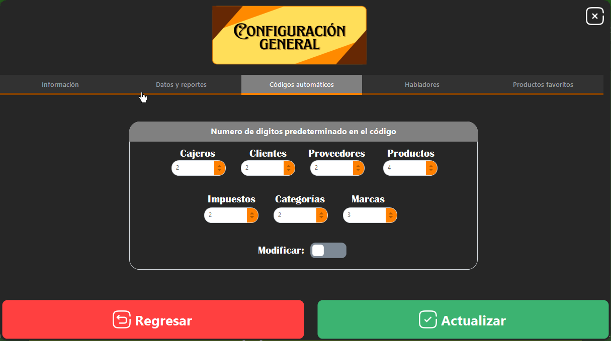

#### Gestión de habladores
Se puede gestinar el tamaño de la letra de forma individual del nombre del producto y el precio de este para ajustarse de mejor manera a la necesidad del sistema
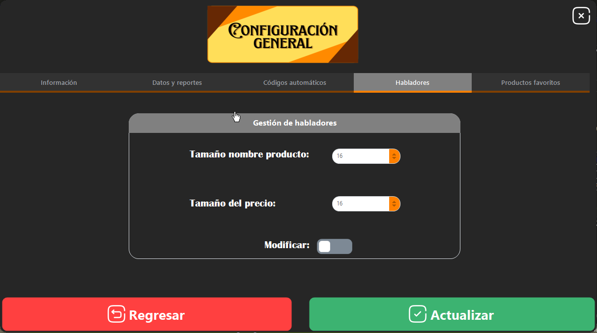

#### Gestión de productos favoritos
Por medio de esta sección de las configuraciones se puede agregar, modificar y eliminar los productos mostrados en los botones en la sección de "Productos favoritos" de la caja. En esta se puede
- Agregar nuevos productos a esta cuadricula
- Reordenar los productos a gusto
- Asignar el color que se decida para cada uno de los productos para facilitar su detección por la vista
- Sacar productos de la lista
Para facilitar el proceso de adición de estos se agregó una barra de busqueda para filtrar por código o por nombre
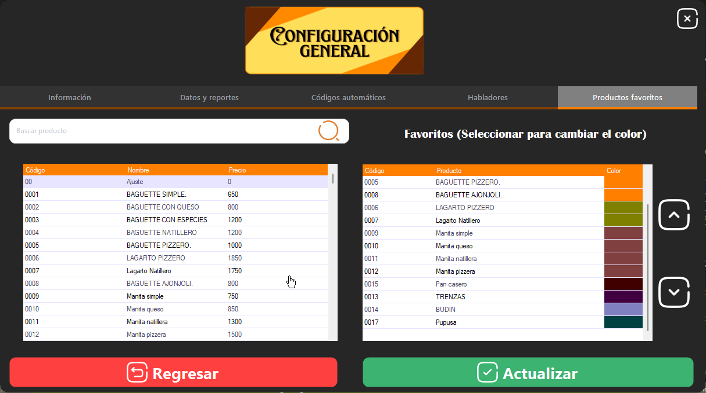
